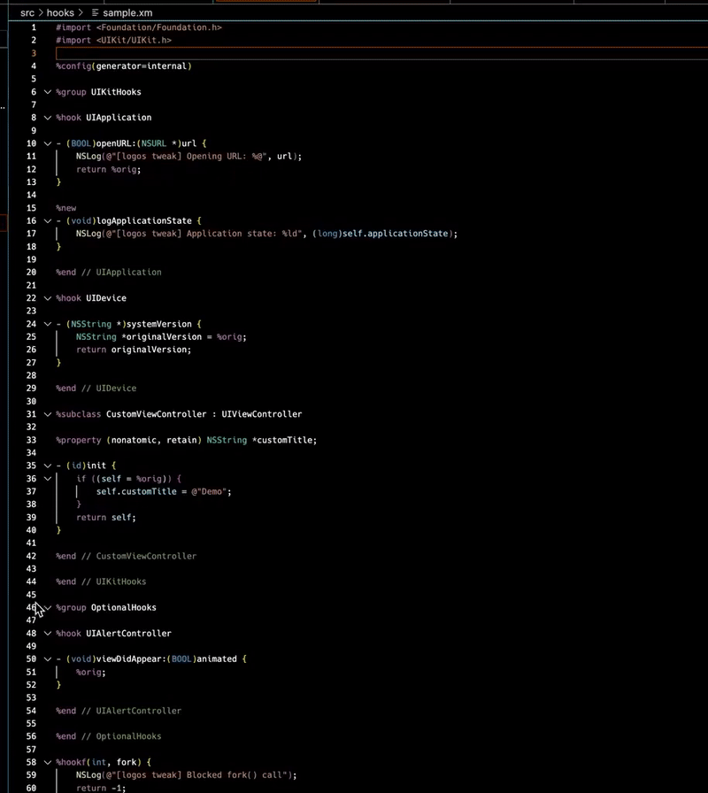

# Logos Syntax Highlighting for VS Code

VS Code extension that provides syntax highlighting for Logos, the preprocessor language used for iOS jailbreak tweak development.

## Installation

1. Clone this repository
2. Copy it into your VS Code extensions folder:
   - Windows: `%USERPROFILE%\.vscode\extensions`
   - macOS/Linux: `~/.vscode/extensions`
3. Restart VS Code

## Usage

### Syntax Highlighting

The extension automatically activates when you open a file with one of these extensions:
- `.x` - Logos file with C syntax
- `.xm` - Logos file with Objective-C/C++ syntax
- `.xi` - Logos file with C syntax that can be included in preprocessor macros
- `.xmi` - Logos file with Objective-C/C++ syntax that can be included in preprocessor macros

